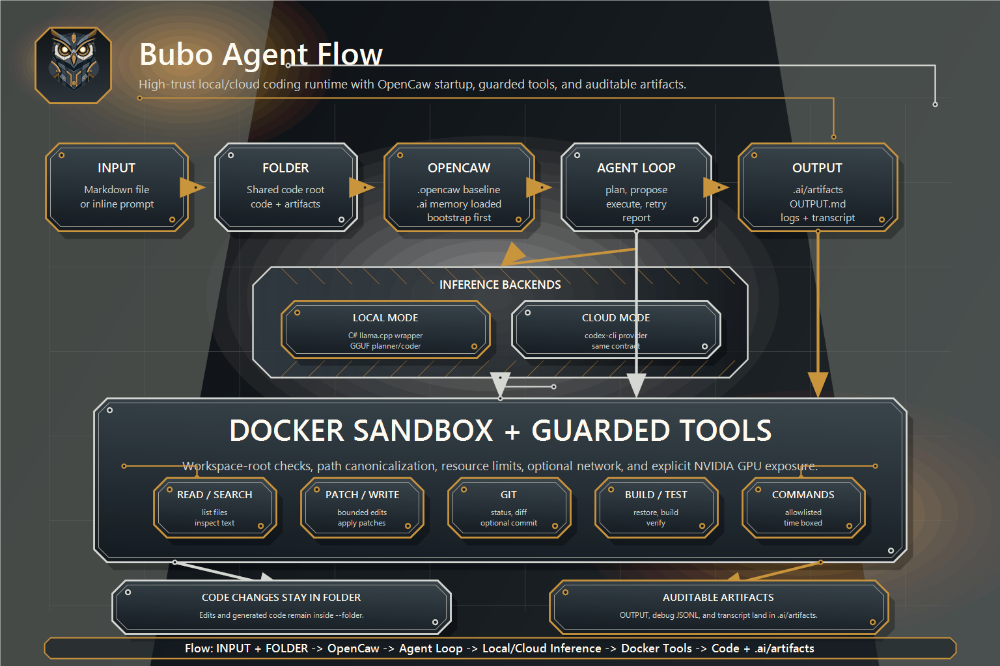

# Bubo

<p align="center">
  
</p>

Bubo is a local-first .NET 8 coding-agent runtime. It reads a task from `INPUT.md`, works inside a supplied code folder, runs guarded tools, and writes auditable results to Markdown and JSONL artifacts.

<p align="center">
  
</p>

The name comes from Bubo, the mythical robotic owl created by Hephaestus.

## Table Of Contents

1. [Quick Start](#quick-start)
2. [What Bubo Does](#what-bubo-does)
3. [How A Run Works](#how-a-run-works)
4. [Input And Output Contract](#input-and-output-contract)
5. [CLI Usage](#cli-usage)
6. [Configuration](#configuration)
7. [Guided Examples](#guided-examples)
8. [Docker Sandbox](#docker-sandbox)
9. [Inference Modes](#inference-modes)
10. [Native Assets](#native-assets)
11. [Tools](#tools)
12. [Security Rules](#security-rules)
13. [Developer Onboarding](#developer-onboarding)
14. [Agent Onboarding](#agent-onboarding)
15. [Troubleshooting](#troubleshooting)
16. [Further Reading](#further-reading)

## Quick Start

Prerequisites:

- .NET 8 SDK.
- Docker Desktop or Docker Engine for sandboxed command execution.
- Optional: `codex-cli` for cloud mode.
- Optional: GGUF models and native llama.cpp assets for local model inference.

Build and test:

```powershell
dotnet restore Bubo.sln
dotnet build Bubo.sln --configuration Release --no-restore
dotnet test Bubo.sln --configuration Release --no-build
```

Build the sandbox image:

```powershell
docker build --pull -f docker/bubo-sandbox/Dockerfile -t bubo-sandbox:local docker/bubo-sandbox
```

CPU example:

```powershell
dotnet run --no-build --configuration Release --project src/LocalAgent.Cli/LocalAgent.Cli.csproj -- sandbox test --workspace . --gpu none
pwsh ./scripts/test-native-package.ps1 -Backend cpu -BuildNative
```

NVIDIA GPU example:

```powershell
dotnet run --no-build --configuration Release --project src/LocalAgent.Cli/LocalAgent.Cli.csproj -- sandbox test --workspace . --gpu nvidia
pwsh ./scripts/test-native-package.ps1 -Rid win-x64 -Backend cuda -CudaArchitectures "120" -CudaToolkitRoot "C:\Program Files\NVIDIA GPU Computing Toolkit\CUDA\v13.2" -Generator Ninja -BuildNative
```

For RTX 50xx / Blackwell GPUs, use CUDA architecture `120` and CUDA Toolkit 12.8 or newer. Adjust `-Rid` and `-CudaToolkitRoot` for your platform.

Run Bubo locally against an OpenCaw-enabled code folder:

```powershell
dotnet run --project src/LocalAgent.Cli/LocalAgent.Cli.csproj -- run --folder ./repo
```

Cloud mode example with `codex-cli`:

```powershell
codex --version
dotnet run --project src/LocalAgent.Cli/LocalAgent.Cli.csproj -- run --folder ./repo --mode cloud
```

Bubo always initializes OpenCaw before reading input. The target folder must contain or be able to create a verified `.opencaw` checkout.

## What Bubo Does

Bubo is built for coding-agent workflows:

- Read user instructions from `INPUT.md`.
- Inspect and modify files inside one code folder.
- Execute deterministic user-provided tool actions.
- Ask a local or cloud inference provider for guarded tool actions when no deterministic action block is provided.
- Initialize an OpenCaw session from the code folder `.opencaw` submodule before reading `INPUT.md`.
- Retry inference-generated repair actions within configured loop limits.
- Run build, test, Git, and command tools through bounded runtime APIs.
- Write `.ai/artifacts/OUTPUT.md`, `.ai/artifacts/agent-debug.jsonl`, and `.ai/artifacts/agent-transcript.md`.
- Keep command execution inside a Docker sandbox.

Bubo treats model output as untrusted. The model proposes actions; the runtime validates and executes them.

## How A Run Works

```text
INPUT.md
   |
   v
LocalAgent.Cli
   |
   v
LocalAgent.Runtime
   |
   +--> deterministic bubo-actions, when present
   |
   +--> local or cloud inference provider, when no action fence is present
   |
   +--> guarded tools
   |
   +--> Docker sandbox for command execution
   |
   v
.ai/artifacts/OUTPUT.md
.ai/artifacts/agent-debug.jsonl
.ai/artifacts/agent-transcript.md
```

Run behavior:

1. Load CLI options and optional configuration.
2. Validate the code folder, input, and output paths.
3. Update and verify the OpenCaw submodule when enabled.
4. Run the OpenCaw host scaffold bootstrap when required, preserving existing `.ai` memory, fragments, learnings, and task files.
5. Load OpenCaw baseline instructions plus host repository context into the inference system prompt.
6. Read `INPUT.md`.
7. Execute a deterministic `bubo-actions` block when present.
8. Otherwise ask the configured inference provider for fenced `bubo-actions` JSON.
9. Execute generated actions through the model-safe tool registry.
10. Feed concise tool observations into retries after retryable tool failures.
11. Stop on success, no actions, invalid action JSON, unknown tools, non-retryable safety failures, provider failure, or loop limits.
12. Write the output report, transcript, and debug log under `.ai/artifacts`.

## Input And Output Contract

Input can be a Markdown file path or inline Markdown passed with `--input`:

```text
INPUT.md
```

The input file may live outside the code folder. If the `--input` value is not an existing Markdown file path and does not look like a missing path, Bubo treats the value itself as the Markdown prompt.

Bubo-owned report artifacts:

```text
.ai/artifacts/OUTPUT.md
.ai/artifacts/agent-debug.jsonl
.ai/artifacts/agent-transcript.md
```

The output report and sidecar artifacts are written under `.ai/artifacts` inside the code folder. `--output` may name a file or subpath under that artifact root, but paths outside `.ai/artifacts` are rejected.
Code edits, generic file tools, Git operations, OpenCaw context, and sandboxed commands still operate on the paths they are given inside `--folder`.

`OUTPUT.md` uses this stable shape:

```markdown
# Result

## Summary

## Plan

## Changes Made

## Files Changed

## Commands Run

## Test Results

## Issues / Risks

## Next Steps
```

`agent-transcript.md` records observable runtime events. It does not expose hidden chain-of-thought.

`agent-debug.jsonl` records structured events for debugging and audit.

## CLI Usage

Main command:

```bash
bubo run \
  --folder ./repo \
  --input ./prompts/INPUT.md \
  --output reports/OUTPUT.md \
  --mode local \
  --config ./bubo.config.json
```

When running from source:

```bash
dotnet run --project src/LocalAgent.Cli/LocalAgent.Cli.csproj -- run --folder ./repo
```

Defaults:

```text
--folder current directory
--workspace compatibility alias for --folder
--input <folder>/INPUT.md, or inline Markdown when explicitly supplied
--output <folder>/.ai/artifacts/OUTPUT.md
--mode local
--config <folder>/bubo.config.json when present
--opencaw-update true
```

Utility commands:

```bash
bubo doctor
bubo models list
bubo sandbox test --workspace ./repo --gpu nvidia
bubo native test --backend cpu --strict
```

From source:

```bash
dotnet run --project src/LocalAgent.Cli/LocalAgent.Cli.csproj -- doctor
dotnet run --project src/LocalAgent.Cli/LocalAgent.Cli.csproj -- models list
dotnet run --project src/LocalAgent.Cli/LocalAgent.Cli.csproj -- sandbox test --workspace . --gpu nvidia
dotnet run --project src/LocalAgent.Cli/LocalAgent.Cli.csproj -- native test --backend cpu --strict
```

## Configuration

Configuration precedence:

1. Built-in defaults.
2. Folder `bubo.config.json`.
3. Explicit `--config`.
4. Explicit CLI flags.

`--mode` is a CLI override. If config says `cloud` and the command says `--mode local`, Bubo runs local.

Folder-default config is treated as repository content. It can configure mode, model profiles, and safe runtime limits. It cannot set trusted sandbox policy such as network mode, GPU mode, Docker image, host model mounts, or hardening switches.

Use explicit `--config` when you deliberately trust sandbox settings:

```bash
bubo run --folder ./repo --config ./bubo.trusted.config.json
```

Example:

```json
{
  "mode": "local",
  "models": {
    "planner": {
      "path": "/models/planner.gguf",
      "contextSize": 32768,
      "temperature": 0.2,
      "topP": 0.9,
      "repeatPenalty": 1.05,
      "maxTokens": 4096,
      "gpuLayers": "auto",
      "threads": 0
    },
    "coder": {
      "path": "/models/coder.gguf",
      "contextSize": 32768,
      "temperature": 0.1,
      "topP": 0.95,
      "repeatPenalty": 1.05,
      "maxTokens": 8192,
      "gpuLayers": "auto",
      "threads": 0
    }
  },
  "limits": {
    "maxIterations": 3,
    "maxToolCalls": 40,
    "maxCommandSeconds": 300,
    "maxPatchBytes": 131072,
    "maxFilesChanged": 15
  }
}
```

OpenCaw bootstrap is mandatory. Bubo expects `.opencaw` to be the OpenCaw submodule, verifies the checkout origin, updates it when configured, runs the scaffold script when required, and preserves project-local `.ai` state. Use these flags for explicit path/ref/update control:

```bash
bubo run --folder ./repo --opencaw-update false
bubo run --folder ./repo --opencaw-path .opencaw --opencaw-ref main
```

OpenCaw path/ref/update policy in JSON config requires explicit `--config`; folder-default `bubo.config.json` cannot silently redirect bootstrap code execution. There is no CLI or config switch that disables OpenCaw loading or bootstrap.

Trusted sandbox policy example:

```json
{
  "sandbox": {
    "image": "bubo-sandbox:local",
    "network": "package-restore",
    "gpu": "nvidia",
    "modelsPath": "C:/Models/Bubo"
  }
}
```

## Guided Examples

### Example 1: No-Action File Contract

Create a demo workspace:

```powershell
$workspace = Join-Path $env:TEMP "bubo-readme-demo"
New-Item -ItemType Directory -Force -Path $workspace | Out-Null
@'
# Task

Say hello from Bubo and prove the output contract works.
'@ | Set-Content -Path (Join-Path $workspace "INPUT.md") -Encoding UTF8
```

Run:

```powershell
git -C $workspace init
git -C $workspace submodule add -b main https://github.com/TimothyMeadows/OpenCaw .opencaw
dotnet run --project .\src\LocalAgent.Cli -- run --folder $workspace --mode local
```

Inspect:

```powershell
Get-ChildItem $workspace
Get-Content (Join-Path $workspace ".ai/artifacts/OUTPUT.md")
Get-Content (Join-Path $workspace ".ai/artifacts/agent-transcript.md")
Get-Content (Join-Path $workspace ".ai/artifacts/agent-debug.jsonl")
```

### Example 2: Deterministic Tool Actions

Use deterministic actions when you want a fixture, smoke test, or controlled automation without model inference.

````markdown
# Task

Write and patch a generated note.

```bubo-actions
[
  {
    "tool": "write_file",
    "arguments": {
      "path": "generated/result.txt",
      "content": "Hello from Bubo.\n"
    }
  },
  {
    "tool": "patch_file",
    "arguments": {
      "path": "generated/result.txt",
      "old": "Hello from Bubo.",
      "new": "Patched by Bubo."
    }
  }
]
```
````

Run:

```bash
bubo run --folder ./repo
```

The deterministic action fence executes once. It does not invoke inference.

### Example 3: Docker-Backed Command Fixture

Build the sandbox image:

```bash
docker build --pull -f docker/bubo-sandbox/Dockerfile -t bubo-sandbox:local docker/bubo-sandbox
```

Use an action block that asks for a guarded command:

````markdown
# Task

Check the .NET SDK version.

```bubo-actions
[
  {
    "tool": "run_command",
    "arguments": {
      "executable": "dotnet",
      "arguments": ["--version"]
    }
  }
]
```
````

`run_command` is routed through the Docker sandbox and avoids shell expansion.

### Example 4: Cloud Mode

Cloud mode uses `codex-cli` behind the same inference abstraction:

```bash
bubo run --folder ./repo --mode cloud
```

When OpenCaw is enabled, the Codex prompt receives OpenCaw baseline instructions and host `.ai` context as system context before the user task.

Or:

```json
{
  "mode": "cloud"
}
```

Cloud mode should only receive secrets when they are explicitly mounted or configured. No host secrets are passed by default.

### Example 5: Local Model Profiles

Local mode is designed for GGUF models. A good starting point for 16 GB GPU memory is:

- Planner: Qwen3 14B Instruct or similar, `Q4_K_M` or `Q5_K_M`.
- Coder: Qwen2.5-Coder 14B Instruct, Qwen3-Coder mid-size, or similar, `Q4_K_M` or `Q5_K_M`.
- Context: `32768` if stable, otherwise `16384`.
- GPU layers: `auto` or as many as fit.

Keep model mounts read-only inside Docker.

## Docker Sandbox

The sandbox image includes:

- .NET SDK.
- `git`.
- GitHub CLI `gh`.
- `openssh-client`.
- `ca-certificates`.
- `curl`.
- `jq`.

Container layout:

```text
/workspace  writable workspace
/input      read-only task input
/output     writable artifact area rooted in the same folder
/models     read-only model mount
/cache      writable cache
```

Default posture:

```text
--network none
--cap-drop ALL
--security-opt no-new-privileges
--read-only where practical
--pids-limit <configured>
--memory <configured>
--cpus <configured>
```

Network modes:

| Mode | Use |
| --- | --- |
| `none` | Normal coding runs. |
| `package-restore` | Dependency restore windows. |
| `research` | Controlled research or downloads. |
| `full` | Explicitly approved unrestricted access. |

GPU mode is explicit. NVIDIA sandbox mode uses `--gpus all`, requires host NVIDIA drivers plus NVIDIA Container Toolkit, and can be checked with:

```bash
bubo sandbox test --workspace . --gpu nvidia
```

## Inference Modes

Local mode:

```text
LocalAgent.Inference.LlamaCpp
  -> LlamaCppSharp
  -> LlamaCppSharp.Native
  -> llama.cpp shared library
```

Cloud mode:

```text
LocalAgent.Inference.opencawCli
  -> codex-cli child process
```

Both modes feed the same runtime contracts and write the same output artifacts.

Native llama.cpp assets use the standard RID layout:

```text
runtimes/
  win-x64/native/llama.dll
  linux-x64/native/libllama.so
  osx-arm64/native/libllama.dylib
```

Pinned upstream reference:

```text
Repository: https://github.com/ggml-org/llama.cpp
Release: b9189
Commit: 64b38b561b987679c4e1c6231f93860d3eec2638
```

## Native Assets

Local mode expects a pinned llama.cpp shared library in the native package layout. CPU remains the default backend.

```powershell
pwsh ./scripts/build-llama-native.ps1 -StageToPackage
```

Build, stage, smoke test, pack, and verify a specific CPU RID:

```powershell
pwsh ./scripts/test-native-package.ps1 -Rid linux-x64 -BuildNative
```

CUDA builds use a backend-specific layout so they do not overwrite CPU assets:

```text
runtimes/<rid>/native/<library>        # CPU
runtimes/<rid>/native/cuda/<library>   # CUDA
```

Build CUDA for recent NVIDIA GPUs, including RTX 50xx / Blackwell:

```powershell
pwsh ./scripts/test-native-package.ps1 -Rid linux-x64 -Backend cuda -CudaArchitectures "86;89;120" -BuildNative
```

RTX 50xx GPUs require architecture `120` and CUDA Toolkit 12.8 or newer. Use `-CudaCompiler` when `nvcc` is not on `PATH`.
On Windows, run from a Visual Studio developer shell or pass CMake generator details explicitly. Ninja is the simplest path when it is available:

```powershell
pwsh ./scripts/test-native-package.ps1 `
  -Rid win-x64 `
  -Backend cuda `
  -CudaArchitectures "120" `
  -CudaToolkitRoot "C:\Program Files\NVIDIA GPU Computing Toolkit\CUDA\v13.2" `
  -Generator Ninja `
  -BuildNative
```

Probe staged assets from source:

```powershell
dotnet run --project src/LocalAgent.Cli/LocalAgent.Cli.csproj -- native test --base-directory src/LlamaCppSharp.Native --backend cuda --strict
```

Native build prerequisites are PowerShell 7, Git, CMake, a platform C++ toolchain, and the .NET 8 SDK. CUDA builds additionally require CUDA Toolkit 12.8+ for RTX 50xx. Windows CUDA builds can use `-Generator`, `-Platform`, `-Toolset`, and `-CudaToolkitRoot` when the default CMake generator cannot infer the toolchain; `-CudaToolkitRoot` also helps runtime smoke tests find CUDA `bin` and `bin/x64` dependencies. The manual `native llama.cpp assets` workflow uses the same scripts in CI. CUDA lanes are opt-in and expect self-hosted NVIDIA runners.

## Tools

Default deterministic tools:

| Tool | Purpose |
| --- | --- |
| `read_file` | Read a UTF-8 file inside the workspace. |
| `write_file` | Write a UTF-8 file inside the workspace. |
| `patch_file` | Apply a bounded exact old/new replacement. |
| `list_files` | Enumerate workspace files. |
| `search_text` | Search workspace text. |
| `run_command` | Run allowlisted commands through Docker without shell expansion. |
| `git_status` | Inspect Git status. |
| `git_diff` | Inspect Git diffs. |
| `git_apply_patch` | Apply guarded unified diffs through Docker-backed `git apply`. |

Inference-generated actions use a smaller model-safe registry. Generic `run_command` is excluded from model-generated repair retries.

Tool safety rules:

- Resolve paths against the workspace root.
- Reject path traversal and workspace escapes.
- Bound tool-call count, file count, patch size, and command duration.
- Treat model output as data, not authority.
- Capture stdout, stderr, exit code, files changed, and issues.
- Stop at configured loop limits.

## Security Rules

Bubo assumes repository content and model output may be hostile.

Default rules:

- No host secrets mounted by default.
- Network disabled by default.
- Input and model mounts are read-only.
- Tool writes stay inside the code folder on their requested paths. Bubo-owned report artifacts stay under `.ai/artifacts`.
- Command execution goes through Docker.
- Tool arguments are validated before execution.
- Git hooks and remote mutations are not trusted by default.
- Bubo does not push, open PRs, merge, or publish unless explicitly configured or requested.
- OpenCaw bootstrap only runs from the verified folder `.opencaw` checkout and records observable bootstrap/update events.
- Output artifacts include summaries, tool observations, and decisions, not hidden chain-of-thought.

Threats the design accounts for:

- Path traversal.
- Prompt injection.
- Command injection.
- Secret exfiltration.
- Network exfiltration.
- Docker escape risk.
- GPU device exposure.
- Malicious package install scripts.
- Accidental edits outside the code folder.

## Developer Onboarding

Repository layout:

```text
src/
  LlamaCppSharp.Native/          Native package metadata and RID asset layout.
  LlamaCppSharp/                 Managed llama.cpp wrapper.
  LocalAgent.Abstractions/       Shared contracts.
  LocalAgent.Runtime/            Agent loop, tools, workspace guard, output artifacts.
  LocalAgent.Inference.LlamaCpp/ Local inference provider.
  LocalAgent.Inference.opencawCli/ Cloud inference provider.
  LocalAgent.Sandbox.Docker/     Docker command runner.
  LocalAgent.Cli/                CLI entrypoint.

tests/
  Unit and smoke tests for contracts, runtime behavior, CLI behavior, native probing, and Docker command construction.
```

Common commands:

```bash
dotnet restore Bubo.sln
dotnet build Bubo.sln --configuration Release --no-restore
dotnet test Bubo.sln --configuration Release --no-build
dotnet format Bubo.sln --verify-no-changes --no-restore
git diff --check
```

Package checks:

```bash
dotnet pack src/LlamaCppSharp.Native/LlamaCppSharp.Native.csproj --configuration Release --no-build --output artifacts/packages
dotnet pack src/LlamaCppSharp/LlamaCppSharp.csproj --configuration Release --no-build --output artifacts/packages
dotnet pack src/LocalAgent.Cli/LocalAgent.Cli.csproj --configuration Release --no-build --output artifacts/packages
```

Native package check:

```bash
pwsh ./scripts/test-native-package.ps1 -Rid linux-x64 -BuildNative
pwsh ./scripts/test-native-package.ps1 -Rid linux-x64 -Backend cuda -CudaArchitectures "86;89;120" -BuildNative
pwsh ./scripts/test-native-package.ps1 -Rid win-x64 -Backend cuda -CudaArchitectures "120" -CudaToolkitRoot "C:\Program Files\NVIDIA GPU Computing Toolkit\CUDA\v13.2" -Generator Ninja -BuildNative
```

Docker checks:

```bash
docker build --pull -f docker/bubo-sandbox/Dockerfile -t bubo-sandbox:local docker/bubo-sandbox
dotnet run --no-build --configuration Release --project src/LocalAgent.Cli/LocalAgent.Cli.csproj -- sandbox test --workspace .
dotnet run --no-build --configuration Release --project src/LocalAgent.Cli/LocalAgent.Cli.csproj -- sandbox test --workspace . --gpu nvidia
```

When adding a tool:

1. Implement `IAgentTool`.
2. Resolve all paths through `WorkspaceGuard`.
3. Add bounded input validation.
4. Record useful `ToolResult` output and errors.
5. Decide whether the tool belongs in the deterministic registry, the model-safe registry, or both.
6. Add tests for success, failure, traversal rejection, and limit enforcement.

When changing inference behavior:

1. Keep deterministic `bubo-actions` single-pass.
2. Keep model-generated actions behind fenced JSON parsing.
3. Treat observations fed back to the model as untrusted text.
4. Preserve side effects and failed-attempt evidence in output artifacts.
5. Cover retry success, retry exhaustion, invalid output, unknown tool, and limit exhaustion.

## Agent Onboarding

Use this section when Bubo itself, Codex, or another coding agent is working in this repository.

Before editing:

- Read `AGENTS.md`.
- Read `.opencaw/AGENTS.md` when present.
- Treat `.opencaw` as the OpenCaw submodule and `.ai` as the host project memory layer.
- Check `git status --short --branch`.
- Prefer the existing project style and tests.
- Keep unrelated local changes intact.

Good task prompts for Bubo:

```markdown
# Task

Make the smallest safe change that updates the CLI help text for sandbox test.

## Validation

- Run the CLI tests.
- Run `dotnet format`.
- Summarize files changed.
```

Good deterministic fixture prompts:

````markdown
# Task

Create a generated note.

```bubo-actions
[
  {
    "tool": "write_file",
    "arguments": {
      "path": "generated/note.txt",
      "content": "Generated by Bubo.\n"
    }
  }
]
```
````

Agent expectations:

- Do not assume network access.
- Do not assume secrets are mounted.
- Do not write code changes outside the folder.
- Do not run destructive Git operations without explicit approval.
- Prefer small patches and focused tests.
- Report commands run and validation results in `.ai/artifacts/OUTPUT.md`.
- Keep hidden chain-of-thought out of artifacts.

## Troubleshooting

### `INPUT.md` Is Missing

Create one:

```bash
echo "# Task" > INPUT.md
bubo run --folder .
```

Or pass inline Markdown directly:

```bash
bubo run --folder . --input "# Task

Summarize this repository."
```

### Docker Is Not On PATH

Check:

```bash
docker version
```

On Windows with Docker Desktop, the CLI is commonly installed at:

```text
C:\Program Files\Docker\Docker\resources\bin\docker.exe
```

Add that directory to `PATH` or call it by full path.

### Sandbox Test Fails

Rebuild the image:

```bash
docker build --pull -f docker/bubo-sandbox/Dockerfile -t bubo-sandbox:local docker/bubo-sandbox
```

Then rerun:

```bash
bubo sandbox test --workspace .
```

Expected output includes versions for `git`, `gh`, and .NET.

### llama.cpp Native Library Is Missing

Expected names:

```text
Windows: llama.dll
Linux:   libllama.so
macOS:   libllama.dylib
```

Run the native build script with package staging:

```bash
pwsh ./scripts/build-llama-native.ps1 -StageToPackage
```

Expected staged path:

```text
src/LlamaCppSharp.Native/runtimes/<rid>/native/<library>              # CPU
src/LlamaCppSharp.Native/runtimes/<rid>/native/cuda/<library>         # CUDA
```

Then run:

```bash
bubo native test --base-directory src/LlamaCppSharp.Native --backend cpu --strict
bubo native test --base-directory src/LlamaCppSharp.Native --backend cuda --strict
```

To probe a staged package layout:

```bash
bubo native test --base-directory src/LlamaCppSharp.Native --backend cuda --strict
```

### `codex` Is Not Found

Check:

```bash
codex --version
```

Then make sure `codex` is on `PATH` before running cloud mode.

## Further Reading

- [Architecture](ARCHITECTURE.md)
- [Configuration](docs/configuration.md)
- [Security Model](docs/security.md)
- [Packaging](docs/packaging.md)
- [Examples](examples/README.md)
